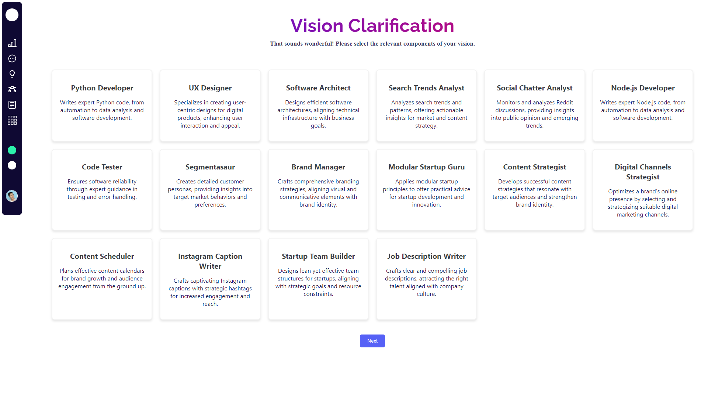
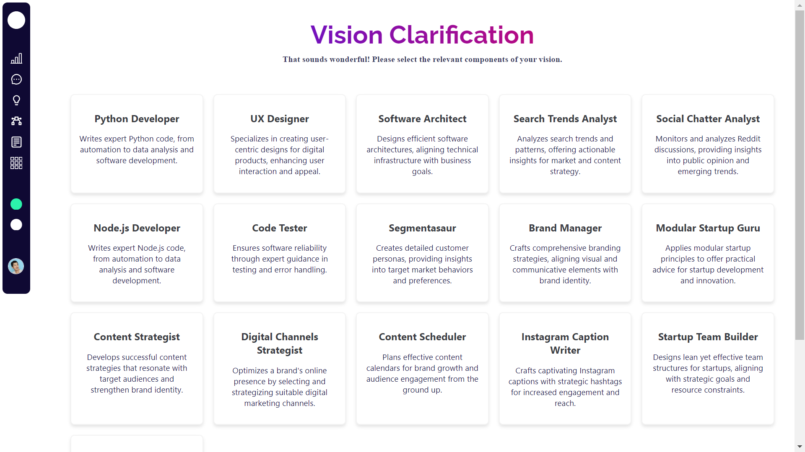

# Getting Started with Create React App

This project was bootstrapped with [Create React App](https://github.com/facebook/create-react-app).

## Available Scripts

In the project directory, you can run:

### `npm start`

Runs the app in the development mode.\
Open [http://localhost:3000](http://localhost:3000) to view it in your browser.

The page will reload when you make changes.\
You may also see any lint errors in the console.

Approach and Assumptions
For this Frontend Developer Code Test from Artus, I approached the tasks systematically to ensure a comprehensive and accurate implementation.

## Task 1: Figma Design Conversion
- I started by thoroughly analyzing the provided Figma design to understand its layout, styling, and interactive elements. I then translated this design into HTML, CSS, and ReactJS components, ensuring responsiveness across different screen sizes using CSS media queries.
- Interactive elements such as buttons and forms were implemented based on the design specifications. I utilized modern CSS techniques and possibly CSS frameworks to streamline styling and achieve fidelity to the original design.

## Task 2: Endpoint Logic Implementation
- For the endpoint logic, I employed JavaScript and ReactJS to fetch data from the `entity_details` API endpoint provided. After retrieving the JSON data, I parsed it and selected 16 entities as specified. These entities were dynamically rendered on cards within the "Vision Card" screen, each displaying the entity's name and snippet. 
- Error handling and asynchronous data fetching were incorporated to ensure smooth operation and a seamless user experience.

## Assumptions
- I assumed that the API (https://entities-alpha.vercel.app/entity_details) would consistently return JSON data in the expected format. I also assumed the design provided in Figma represents the final visual and functional requirements accurately. 
- Throughout the implementation, adherence to best practices in frontend development, including code modularity, reusability, and performance optimization, was prioritized to deliver a robust solution.

This approach aimed to meet the project's objectives effectively within the given time frame, focusing on accuracy, responsiveness, and logical handling of both design and data integration aspects.

